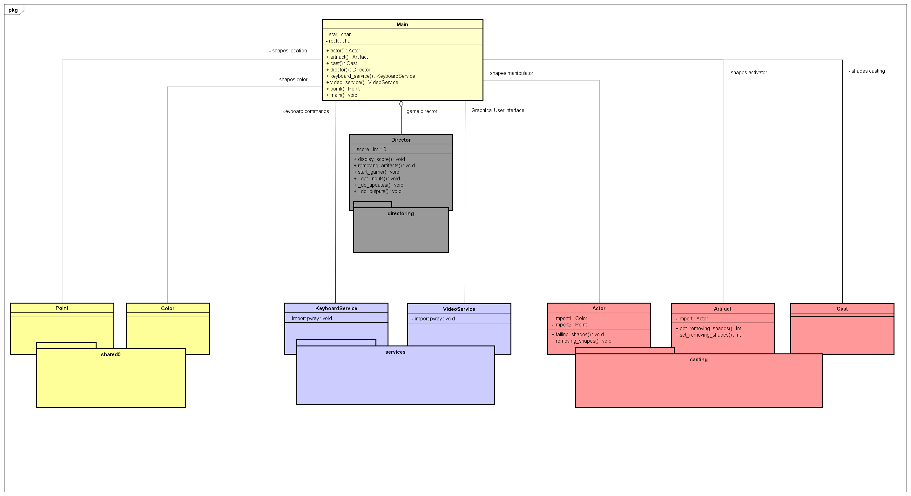

# Greed Game

> He who is not contented with what he has,
> would not be contented with what he would like to have.
>
> Socrates -

## Getting Started

---

Make sure you have Python 3.8.0 or newer and Raylib Python CFFI 3.7 installed and running on your machine. You can install Raylib Python CFFI by opening a terminal and running the following command.

```
python3 -m pip install raylib
```

After you've installed the required libraries, open a terminal and browse to the project's root folder. Start the program by running the following command.

```
python3 greed
```

You can also run the program from an IDE like Visual Studio Code. Start your IDE and open the
project folder. Select the main module inside the hunter folder and click the "run" icon.

## Project Structure

---

The project files and folders are organized as follows:

```
root                    (project root folder)
+-- greed               (source code for game)
  +-- directoring       (director class for game)
  +-- casting           (specific game classes)
  +-- services          (services game classes)
  +-- shared            (game definition classes)
  +-- __main__.py       (entry point for program)
+-- design.png          (UML Class design)
+-- README.md           (general info)
```

## Game Design

This will be the design of our game


## Required Technologies

---

- Python 3.8.0
- Raylib Python CFFI 3.7

## Authors

---

- Amon Brollo
- Giovanni Bonfim
- Isiakpona Chuks
- Jason McLaughlin (email: jasnatbyui@gmail.com)
- Kyla Papa
- Ronilo Gulay
- Alan Montoya
